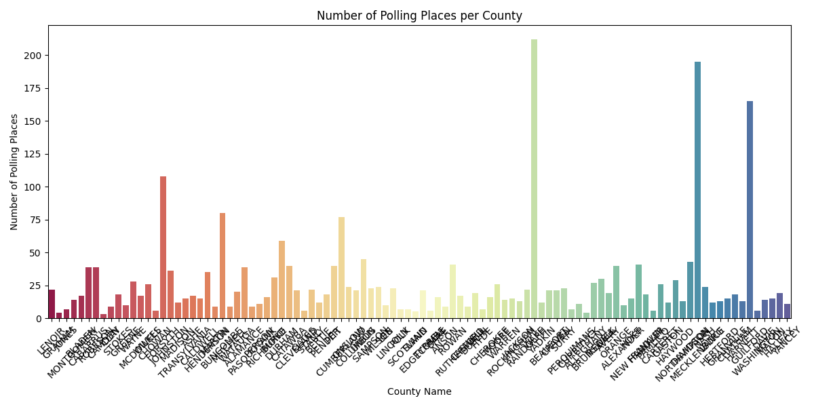

# Polling Places Analysis Report

## Descriptive Statistics

**Mean Number of Polling Places per County:** 26.16

**Median Number of Polling Places per County:** 17.0

**Standard Deviation of Polling Places per County:** 33.52

This section provides the summary statistics of polling places across different counties. The mean, median, and standard deviation help in understanding the distribution of polling places.

## Visualizations

### Polling Places per County

## Conclusion

From the analysis, we observe the distribution of polling places across counties. Further analysis could include comparing these numbers with voter population data to ensure accessibility.
